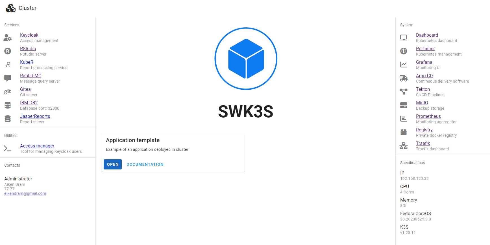

# Tutorial

[Video link](https://youtube.com/2D)

## 1. Create new deployment

Download `build.tar.gz` and `build-tool.tar.gz` from [releases](https://github.com/EikenDram/kube-build/releases/) for your platform and unpack them

Open `config/values.yaml` and change necessary parameters:

| PARAMETER                 | DESCRIPTION
|---------------------------|-------------------
| **server**                | 
| hostname                  | hostname of your server
| ip                        | ip address of your server
| ssh                       | generate ssh key to access server with command `ssh-keygen` and copy content of `id_rsa.pub`
| admin.name admin.password | credentials for server's user that will use password authentication in case ssh key gets lost
| ntp                       | NTP server in your air-gapped network
| dummy                     | dummy default route for your server, if your network configuration doesn't have one
| **cluster**               |
| user password             | credentials that will be used for accessing most cluster resources
| **registry**              |
| user password             | credentials that will be used for accessing private docker registry
| cert                      | self-signed certificate configuration for docker registry
| **charts**                |
| user password             | credentials that will be used for accessing chartmuseum repository
| **prometheus**            |
| endpoint                  | endpoint for prometheus
| **velero**                |
| minio-url minio-public    | urls to minio server
| **kube-home**             |
| contacts spec minio utils | configuration for cluster's home page

Once `values.yaml` is ready, run build tool in project root directory to build deployment in `deployment` directory:
```sh
./build
```

Build tool supports optional parameters to change default configuration files and directory names, check the available options by running tool with `--help` flag:
```sh
./build --help
```

## 2. Prepare necessary files

Server will be in air-gapped environment so we'll need to download and transfer all the necessary files to the server first.

Run the `prepare.sh` script in `deployment` directory:
```sh
sh prepare.sh
```

We'll need to run it on an internet-facing machine in linux shell (for example, [Windows Subsystem for Linux](https://learn.microsoft.com/en-us/windows/wsl/install-manual)) while having necessary tools:

- [helm](https://helm.sh/docs/intro/install/) for pulling helm charts
```sh
# for ubuntu:
curl https://baltocdn.com/helm/signing.asc | gpg --dearmor | sudo tee /usr/share/keyrings/helm.gpg > /dev/null
sudo apt-get install apt-transport-https --yes
echo "deb [arch=$(dpkg --print-architecture) signed-by=/usr/share/keyrings/helm.gpg] https://baltocdn.com/helm/stable/debian/ all main" | sudo tee /etc/apt/sources.list.d/helm-stable-debian.list
sudo apt-get update
sudo apt-get install helm
```

- [skopeo](https://github.com/containers/skopeo/blob/main/install.md) for downloading docker images
```sh
# for ubuntu:
sudo apt-get -y install skopeo
```

- [git](https://git-scm.com/book/en/v2/Getting-Started-Installing-Git) for cloning git repositories
```sh
# for ubuntu:
sudo apt install git
```

- `mkpasswd` and `htpasswd` tools for encrypting passwords

`prepare.sh` script supports optional parameters to prepare only specific parts of the deployment, check the available options by running:
```sh
sh prepare.sh -h
```

## 3. Install Fedora CoreOS on the new server

First you'll need to generate ignition file by running
```sh
sh ignition.sh
```
and then having the ignition file `deployment/coreos.ign` to be accessible from some URL on the new server, for example: `http://URL/coreos.ign`

Live ISO will be downloaded to `deployment/bin/os/` directory, mount it on a new server and it'll load into memory-only mode with command prompt. 

Run this command to install CoreOS:
```sh
sudo coreos-installer install /dev/sda --ignition-url http://URL/coreos.ign --insecure-ignition
```

Remove ISO and reboot the server with:
```sh
sudo reboot
```

## 4. Deploy cluster components

Next step is to install kubernetes cluster and deploy applications on the server

Transfer necessary files to the server with `transfer.sh` script in `deployment` directory:
```sh
sh transfer.sh
```

`transfer.sh` script supports optional parameters to transfer only specified parts of the deployment, you can check the available options by running:
```sh
sh transfer.sh -h
```

After transferring files connect to server with ssh (for example, `ssh user@HOSTMANE` where `user` is server user defined in `values.yaml` and `HOSTNAME` is server's hostname), go to `deployment` directory on a server and start running scripts:

### Initialize OS

```sh
sudo os.sh
```

### Install K3S

```sh
sudo k3s.sh -i
k3s.sh -a
```

Wait until kubernetes cluster is up, you can monitor cluster with
```sh
k9s
```


### Deploy docker registry

```sh
sudo registry.sh -i
sudo registry.sh -a
```

### Deploy OpenEBS

```sh
sudo openebs.sh -i
openebs.sh
```

Reboot server with
```sh
sudo reboot
```
to remove `local-storage` from K3S

### Deploy Chartmuseum

```sh
sudo chartmuseum.sh -i
chartmuseum.sh
```

### Deploy Keycloak

```sh
keycloak.sh
```

### Configure Keycloak

Access Keycloak cluster with provided URL:


Create new realm called "cluster":


Create new client scopes called "audience":


and "groups":


Create new client called "oauth2-proxy":


Create new user as provided in `values.yaml`:


Check that user can authorize in client:


### Deploy OAuth2-proxy

```sh
sudo oauth2.sh -i
oauth2.sh
```

### Deploy Kubernetes dashboard

```sh
dashboard.sh
```

User provided long-lived token to access kubernetes dashboard

### Deploy Portainer CE

```sh
portainer.sh
```

Access portainer with provided URL and complete initial setup before portainer goes into timeout mode

### Deploy Docker registry UI

```sh
registry-ui.sh
```

Access registry with provided URL and allow insecure certificates to be able to use registry dashboard

### Deploy Traefik dashboard

```sh
traefik-ui.sh
```

### Deploy Prometheus and Grafana

```sh
sudo prometheus.sh -i
prometheus.sh
```

### Deploy Loki

```sh
loki.sh
```

To view logs in grafana, add http://loki.monitoring:3100 as a new loki data source:


Import `loki-dashboard.json` from `bin/loki/` as a new dashboard in grafana to monitor loki logs:


### Deploy MinIO

This will install minio on same server as kubernetes cluster:
```sh
sudo minio.sh -i
sudo minio.sh
```

Access MinIO with provided URL and create a new bucked with the name "k3s":


### Deploy Velero

```sh
sudo velero.sh -i
velero.sh
```

### Deploy Gitea

```sh
sudo gitea.sh -i
gitea.sh
```

### Deploy ArgoCD

```sh
sudo argocd.sh -i
argocd.sh
```

### Deploy Tekton

```sh
sudo tekton.sh -i
tekton.sh
```

### Deploy images for developing applications

```sh
dev.sh
```

### Deploy RabbitMQ server

```sh
rabbitmq.sh
```

### Deploy IBM DB2 server

```sh
ibmdb2.sh
```

### Deploy IBM DB2 data management console

```sh
sudo db2console.sh -i
db2console.sh -a
```

Access console with provided URL and configure repository database:


### Deploy KubeHome

```sh
kube-home.sh
```

This will install home page for cluster as ArgoCD application:



### Deploy KubeR

```sh
kube-r.sh
```

### Deploy KubeUtils

```sh
kube-utils.sh
```

### Deploy KubeAppTemplate

```sh
kube-app-template.sh
```